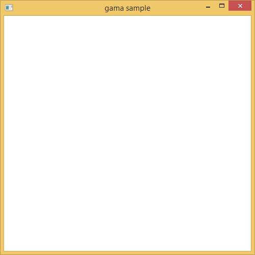
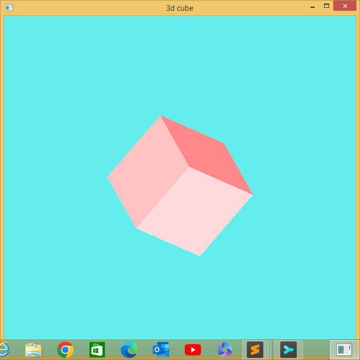

# gama
A, verry little C++ gui toolkit for windows

Gama is a folder with a bunch of header files.
It provides classes and functions which interfere for you with
most of the window creation and shapes stuff.

Gama is a library intended to interrest some of my classmates
into C++ programming.

## an enlightened cube example

### Setting up the scene

Gama does not yet support scenes, but this is a basic
and empty code:

```c++
#include "gama/gama.hpp"

int load(Gama *gama)
{
    return 1;
}
int init(Gama *gama)
{
    return 1;
}
int update(Gama *gama)
{
    return 1;
}
int render(Gama *gama)
{
    return 1;
}
```



### modifying background, size title

```c++
#include "gama/gama.hpp"

int load(Gama *gama)
{
    return 1;
}
int init(Gama *gama)
{
    gama->title = "3d cube";
    gama->width = 700;
    gama->height = 700;
    gama->clearColor->set(CORNFLOWERBLUE);
    return 1;
}
int update(Gama *gama)
{
    return 1;
}
int render(Gama *gama)
{
    return 1;
}
```

You notice the clearColor was set to `CORNFLOWERBLUE`, it is a macro which
expands to the r, g, b values. Exactly 148 colors are supported so if you think
of one, it should surely be defined, but you could define a new one with the
syntax:

```c++
#define GAMA rgbColor(240, 248, 255)
```


## drawing a cube

```c++
#include "gama/gama.hpp"
#include "gama/Shape.hpp"

Cube *cube;

int load(Gama *gama)
{
    return 1;
}
int init(Gama *gama)
{
    gama->title = "3d cube";
    gama->width = 700;
    gama->height = 700;
    gama->clearColor->set(CORNFLOWERBLUE);

    cube = new Cube(
        new Vector(  0,   0,   0),  // The cube's center position
        new Vector(0.5, 0.5, 0.5)  // The cube's size
    );
    cube->color->set(CRIMSON);
    return 1;
}
int update(Gama *gama)
{
    cube->update(1);  // Update the cube's vertices as of 1s difference.
    return 1;
}
int render(Gama *gama)
{
    cube->render();
    return 1;
}
```


## Rotating the cube

Setting `cube->rotation->vel` modifies the speed at which the cube rotates

```c++
#include "gama/gama.hpp"
#include "gama/Shape.hpp"

Cube *cube;

int load(Gama *gama)
{
    return 1;
}
int init(Gama *gama)
{
    gama->title = "3d cube";
    gama->width = 700;
    gama->height = 700;
    gama->clearColor->set(CORNFLOWERBLUE);

    cube = new Cube(
        new Vector(  0,   0,   0),  // The cube's center position
        new Vector(0.5, 0.5, 0.5)  // The cube's size
    );
    cube->color->set(CRIMSON);
    cube->rotation->vel->x = 1;
    cube->rotation->vel->y = 1;
    return 1;
}
int update(Gama *gama)
{
    cube->update(1);  // Update the cube's vertices as of 1s difference.
    return 1;
}
int render(Gama *gama)
{
    cube->render();
    return 1;
}
```


> [!Note]
> The cube is rotating


## Adding light

```c++
#include "gama/gama.hpp"
#include "gama/Shape.hpp"

Cube *cube;

int load(Gama *gama)
{
    return 1;
}
int init(Gama *gama)
{
    gama->title = "3d cube";
    gama->width = 700;
    gama->height = 700;
    gama->clearColor->set(CORNFLOWERBLUE);

    cube = new Cube(
        new Vector(  0,   0,   0),  // The cube's center position
        new Vector(0.5, 0.5, 0.5)  // The cube's size
    );
    cube->color->set(CRIMSON);
    cube->rotation->vel->x = 1;
    cube->rotation->vel->y = 1;
    cube->rotation->vel->z = 1;

    gama->lights.push_back(new Light(
        0,                  // Light id from 0-7
        LightType::DIFFUSE, // LightType enum: DIFFUSE|AMBIENT|SPECULAR
        255, 255, 255,      // light color
        0.01f,                // intensity
        0.0, 0.0, -1.0      // light position
    ));
    return 1;
}
int update(Gama *gama)
{
    cube->update(1);  // Update the cube's vertices as of 1s difference.
    return 1;
}
int render(Gama *gama)
{
    cube->render();
    return 1;
}

```


