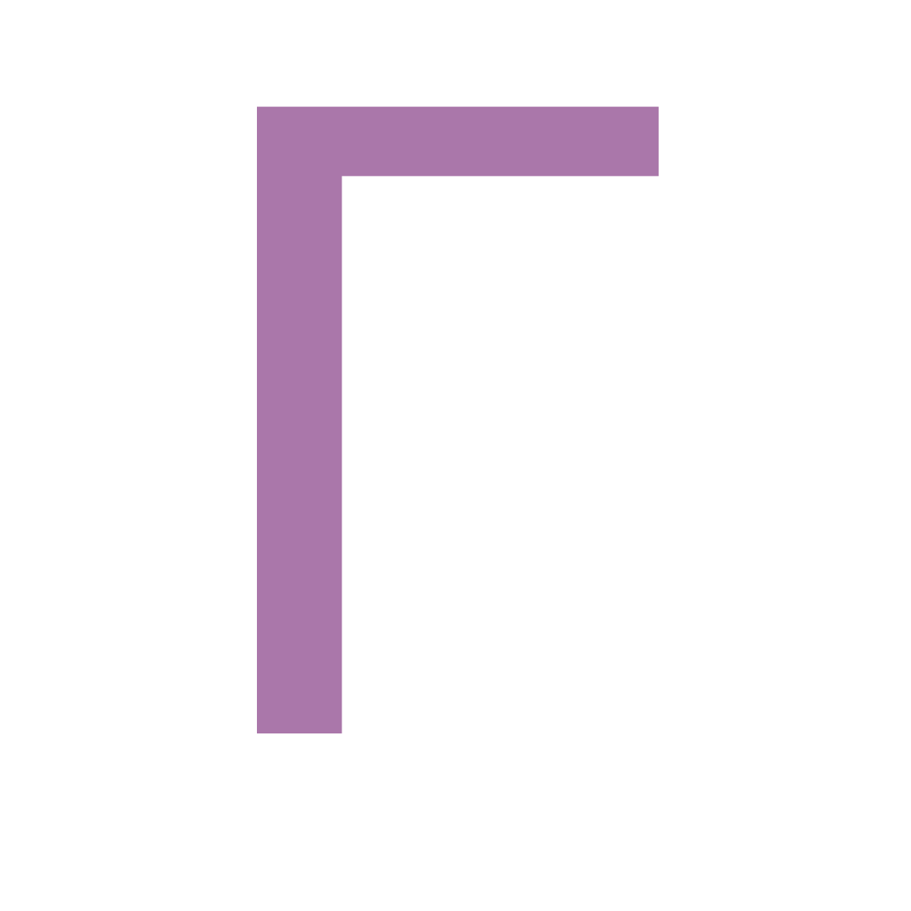

# Gama: A Simple C Game Engine

[](https://opensource.org/licenses/MIT)

Gama is a lightweight, cross-platform game engine written in C, designed with simplicity and education in mind. It aims to provide a convenient and powerful way for students and beginners to create 2D games(and some real-time graphical applications) while learning the fundamentals of C programming. The engine prioritizes a minimal, clean C API, control over the game loop, and a stack-first memory philosophy.





## Philosophy

Gama is built on a few core principles to make game development in C more approachable and fun:

-   **You Have Control**: Gama gives you, the developer, full control over the main game loop. The engine provides utilities but stays out of your way.
-   **Stack First, Heap Less**: The API encourages using stack-allocated data structures to leverage C's automatic memory management and reduce the cognitive load of `malloc` and `free`.
-   **No Global State**: Gama is designed to avoid global state. You can structure your game into different scenes (as simple C functions), each with its own initialization, objects, and cleanup.
-   **Immediate Mode**: The 2D rendering API follows an immediate-mode paradigm. You draw shapes directly each frame, which simplifies state management and is perfect for learning.

## Features

### Core Engine
- **Cross-Platform**: Build and run your games on **Linux**, **Windows**, and the **Web** (via WebAssembly). Gama foundations in C make even more different domains available, but that's additional work to be done as needed
- **Simple C API**: A clean, beginner-friendly C99 API.
- **Full Game Loop Control**: You own the `main` loop.
- **Custom Memory Allocator**: A static-pool-based `malloc` implementation, ideal for controlled memory environments like WASM.
- **Lightweight**: gama installation is less than 400MB on windows(with zig and tcc toolchains),
  and less than 50MB on linux(relying on system packages).

### Rendering
- **2D Immediate-Mode Graphics**: Simple functions to draw primitive shapes like rectangles, circles, lines, and triangles.
- **2D Sprite Animation**: A complete sprite system with support for sprite sheets and custom animation sequences.
- **3D Software Rasterizer**: A built-in 3D rendering pipeline that projects 3D models onto a 2D image buffer, complete with lighting and backface culling.
- **3D Model Loading**: Support for loading `.obj` and `.gltf` 3D models.
- **Material & Texture Support**: The 3D pipeline supports basic material properties (diffuse color, shininess) and will use the average color of a texture if one is provided.

### Physics
- **Built-in 2D Physics Engine**: A simple physics simulation for your 2D games.
- **Collision Detection**: Supports Circle-vs-Circle, Rectangle-vs-Rectangle, and Circle-vs-Rectangle collision detection.
- **Physics Bodies**: Create bodies with properties like mass, velocity, acceleration, and restitution (bounciness).
- **Physics System**: Manage groups of bodies, apply global forces like gravity, and handle collisions automatically.

### UI & Widgets
- **Immediate-Mode UI**: A suite of skinnable, immediate-mode UI widgets.
- **Available Widgets**:
    - `gmw_button`: An interactive button.
    - `gmw_switch`: A toggle switch.
    - `gmw_scale`: A slider for selecting a value in a range.
    - `gmw_joystick`: A virtual joystick for on-screen controls.
    - `gmw_frame`: A panel for grouping UI elements.
- **Theming System**: A simple system for saving and restoring widget themes to easily change UI styles.

### Compiler Toolchain
- **Zero-Setup on Windows**: On Windows, Gama comes bundled with pre-configured **TCC** and **Zig** compilers. No external downloads or `PATH` configuration needed.
- **System-Native on Linux**: On Linux, Gama relies on `tcc` and `zig` from your system's package manager, ensuring seamless integration.
- **`gama dev` for Rapid Development**: Use `gama dev` to instantly run your project with the fast **TCC** compiler. This command also features hot-reloading for rapid iteration.
- **`gama build` for Optimization**: When ready to create a release build, `gama build` uses the more powerful and optimizing **Zig CC** compiler.
- **Direct Compiler Access**: Gama provides proxy commands to access the underlying compilers directly, which is great for educational purposes or advanced build scripting. You can use `gama tcc`, `gama zig`, and `gama zcc` as direct replacements for the real commands.

### And More...
- **Animation Utilities**: A collection of easing functions (`spring`, `ease-in`, `ease-out`) for smooth animations.
- **Input Handling**: Straightforward functions for checking keyboard and mouse state.
- **Math & Debug Libraries**: A custom math library and simple print-based debugging macros.

## Architecture Overview

Gama's cross-platform power comes from its flexible backend architecture.

-   **`libvgama`**: The native heart of the engine. Written in V, `libvgama` runs a `sokol`-based game loop, providing a fast and efficient rendering backend via `gg`.
-   **`gama.js`**: The web backend. This TypeScript runner uses a Web Worker and `SharedArrayBuffer` to run your C code (compiled to WASM) off the main thread for maximum performance in the browser.

## Getting Started

Getting started with Gama is designed to be as simple as possible.

1.  **Download and Install**:
    -   **Windows**: Download and run the latest `gama-*-windows-setup.exe` from the [releases page](https://github.com/ken-morel/gama/releases). The installer handles everything for you.
    -   **Linux**: Download the `.deb` or `.pkg.tar.zst` package and install it with your system's package manager. Make sure you also have `tcc` and `zig` installed (`sudo apt install tcc zig` or `sudo pacman -S tcc zig`).

2.  **Create a New Project**:
    Open a terminal and run:
    ```bash
    gama new my_first_game
    ```

3.  **Run in Development Mode**:
    Navigate into your new project and start the development server:
    ```bash
    cd my_first_game
    gama dev
    ```
    Your game window will appear, and the code will automatically re-compile and re-run whenever you save a change.

4.  **Build for the Web**:
    To compile your project for a web browser, run:
    ```bash
    gama build web
    ```
    This will create a `build/web` directory containing all the files needed to run your game on a local web server.

## Development with Gama

Here is a simple example of a "Hello, World" application in Gama to demonstrate the basic structure.

```c
#include <gama.h>

int main() {
  // Initialize the engine and create a 600x400 window
  gm_init(600, 400, "Hello Gama!");

  // Set a background color
  gm_background(GM_DARKSLATEGRAY);

  // Main game loop
  while (gm_yield()) {
    // gm_yield() handles events, clears the screen, and returns
    // true as long as the window is open.

    // Draw a red rectangle in the center of the screen
    gm_draw_rectangle(0, 0, 0.5, 0.3, GM_RED);

    // Draw some text
    gm_draw_text(0, 0, "Hello, World!", "default-ui", 0.1, GM_WHITE);
  }

  // The engine will automatically handle cleanup on exit.
  return 0;
}
```
## Development on Gama

### Prerequisites
- **V Compiler**: The `mng` build script is written in V. You will need to install the V compiler from [vlang.io](https://vlang.io).
- **A C Compiler**: For building `vlibvgama` (e.g., `clang` or `gcc`).
- **`bun`**: For building `gama.js`.
- **`unzip`**: The `mng` script uses `unzip` to set up the Zig toolchain for packaging.
- **Doxygen (Optional)**: For generating reference documentation.
- **`makensis` (Optional)**: For building the Windows installer.
- **`nfpm` (Optional)**: For creating `.deb` packages.

### Building and Running

The project uses two primary scripts for development and packaging, both located at the project root.

-   **`./mng`**: This is a task runner written in V, used for most common development operations. It allows you to build individual components of the Gama ecosystem.
    -   `./mng build`: Compiles the `gama` CLI tool for all target platforms.
    -   `./mng runner native`: Builds the `libvgama` native library.
    -   `./mng runner web`: Builds the `gama.js` web runner.
    -   `./mng get-zig`: Downloads and sets up the Zig compiler needed for packaging.
    -   `./mng package`: Creates the final distributable packages (`.deb`, `.tar.zst`, `.exe` installer).

-   **`./all`**: This is a simple shell script that runs the entire build and packaging pipeline from start to finish. It's the easiest way to ensure all components are up-to-date and generate a full release.

## Project Structure
- `lib/gama/`: Contains all the core C header files for the engine's modules (3D, physics, widgets, etc.).
- `gama/`: Vlang source code for the main `gama` CLI tool and build logic.
- `gama.js/`: TypeScript source for the WebAssembly frontend and JS/C interop.
- `mng`: The main V script used for building, packaging, and managing the project.
- `all`: The master shell script to build and package everything.
- `runners/`: Contains the platform-specific code for running Gama applications (e.g., on web or native).
- `site/`: SvelteKit source code for the official website and documentation portal.
- `test/`: Contains example projects and test cases for the engine.

## Contributing
Contributions are welcome! Please feel free to submit a pull request or open an issue.

To contribute to the website or documentation:
- The website source code is in the `site/` directory.
- The API reference is generated automatically with Doxygen via the `./mng docs` command.

## License
This project is licensed under the MIT License - see the [LICENSE](./LICENSE) file for details.
